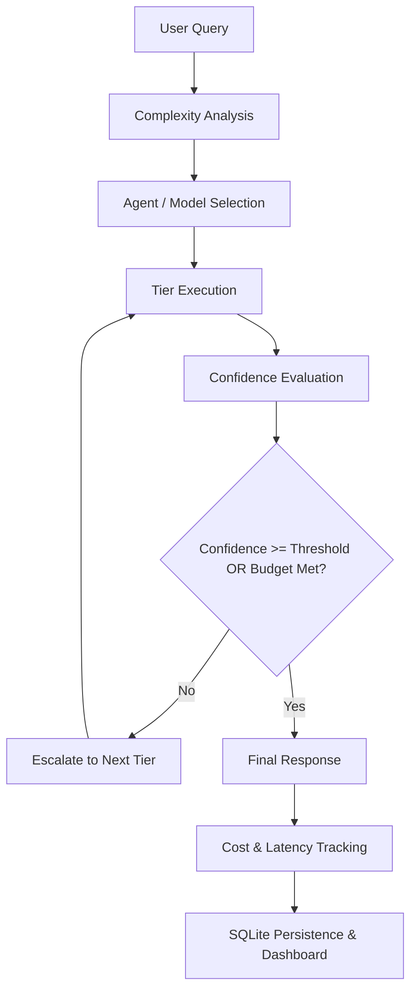

# Cost-Aware Agent Router (CAAR)

[](https://www.python.org/)
[](https://fastapi.tiangolo.com/)
[](LICENSE)
[](#-testing)
[](#-benchmark-results)

A confidence-based, multi-tier LLM routing system that dynamically routes queries to the lowest-cost capable agent and escalates only when confidence is insufficient.

---

## 💡 Why CAAR?

* **Lower Unnecessary LLM Inference Cost**: Reduces API spend by routing simple and structured tasks to high-throughput, low-cost tiers instead of frontier models.
* **Avoid Frontier Over-Provisioning**: Prevents routing routine factual queries to expensive frontier endpoints.
* **Automatic Difficulty Escalation**: Dynamically promotes complex reasoning, failed syntax, or hedging responses to higher-capability agent tiers.
* **Measurable Trade-offs**: Quantifies trade-offs across cost, latency, and accuracy with token-level accounting.
* **Auditable Routing Paths**: Provides step-by-step audit logs, confidence scores, and token spend per execution.
* **Offline Mock & Live Provider Modes**: Operates with zero configuration out-of-the-box using deterministic offline simulations, with optional support for live frontier LLM providers (OpenAI, Anthropic, Gemini).

---

## 🎯 Problem Statement & Motivation

Modern Large Language Model (LLM) deployments face a critical cost-versus-capability dilemma:

* **Cost Inefficiency**: Frontier LLMs (e.g., GPT-4o) offer high accuracy and robust instruction following but cost orders of magnitude more per token and incur higher latency. Sending every routine or simple factual query to a frontier model wastes substantial compute budget.
* **Quality Compromises**: Lightweight models (e.g., GPT-4o-mini) are cost-effective and fast, but they frequently fail on complex multi-step reasoning, strict JSON structured output requirements, or domain-specific tasks.
* **Variable Query Complexity**: Real-world query distributions are heterogeneous. A significant fraction of production queries can be satisfied by lower-cost tiers, while only a subset truly requires multi-agent consensus or frontier-tier reasoning.

Uniformly routing all requests to either extreme results in either unacceptable API expenses or compromised output reliability.

### How CAAR Solves This

CAAR addresses this challenge by combining:
* **Complexity-aware initial routing** to start queries at the most appropriate baseline tier.
* **Confidence-based acceptance** evaluating structural validity and epistemic certainty.
* **Dynamic escalation** across a multi-tier agent cascade when confidence is insufficient.
* **Cost tracking** with granular token-level expenditure accounting.
* **Latency tracking** across every execution step.
* **Audit logging** for transparent decision tracing.
* **Multi-tier agents** specialized for different task complexities.

---

## 🧠 How It Works

The routing pipeline follows a deterministic and observable execution flow:



### Core Routing Pipeline

1. **User Query Ingestion**: The client submits a prompt with optional domain classification, format expectations (`json`, `python`), and budget limits.
2. **Complexity Analysis**: Evaluates whether the prompt can start at Tier 1 (Cheap) or requires higher baseline capability (e.g., starting at Tier 2 for knowledge retrieval, Tier 3 for coding/math, or Tier 4 for audit-grade tasks).
3. **Agent/Model Selection & Tier Execution**: The chosen agent executes the prompt using either local mock simulation or real LLM providers via LiteLLM.
4. **Confidence Evaluation**: `ConfidenceEvaluator` calculates a composite confidence score:
   - **Syntactic Analysis**: Validates structural compliance (strict JSON schema / Python syntax checks).
   - **Semantic Hedging**: Scans for uncertainty phrases (e.g., *"I am not sure"*, *"probably"*, *"cannot guarantee"*).
5. **Accept or Escalate**:
   - If confidence meets or exceeds the domain policy threshold, the response is accepted.
   - If confidence is insufficient and budget allows, execution dynamically escalates to the next tier.
6. **Final Response & Audit Logging**: Returns the generated text, audit trail, execution path, token counts, latency measurements, and monetary savings against frontier baselines.

---

## ✨ Key Features

* **Confidence-Based Routing**: Combines syntactic verification and semantic hedging detection to quantify output reliability before acceptance.
* **Multi-Agent Tier Execution**:
  - **Tier 1 (Cheap Agent)**: High-speed, low-cost baseline (GPT-4o-mini tier).
  - **Tier 2 (RAG Agent)**: Retrieval-augmented agent for context-grounded queries.
  - **Tier 3 (Frontier Agent)**: High-precision frontier LLM (GPT-4o tier) for complex coding and reasoning.
  - **Tier 4 (Consensus Agent)**: Multi-agent verification loop with critic pass for mission-critical tasks.
* **Dynamic Escalation**: Seamlessly promotes under-confident responses to higher tiers without manual intervention.
* **Granular Cost Tracking**: Token-level expenditure calculation with local pricing tables and LiteLLM fallback rates.
* **Latency & Token Usage Profiling**: Wall-clock latency and token breakdown (input/output) recorded per execution step.
* **Zero-Config Mock / Sandbox Mode**: Fully deterministic built-in offline engine allowing complete local testing without external API keys.
* **Optional Real LLM Integration**: Multi-provider support (OpenAI, Anthropic, Gemini) via unified LiteLLM client orchestration.
* **Built-in Benchmark & Evaluation Framework**: Automated evaluation harness measuring accuracy, cost, latency, and escalation rates across multiple strategies.
* **FastAPI REST Backend**: Asynchronous REST API with structured Pydantic schemas, dependency injection, and SQLite ORM persistence.
* **Interactive Web Dashboard**: Live SPA interface featuring real-time analytics KPIs, sandbox testing, policy threshold sliders, and detailed routing log inspection.
* **Interactive Swagger / OpenAPI Documentation**: Auto-generated interactive API exploration and schema validation at `/docs`.

---

## 🏗️ System Architecture

CAAR is structured into modular layers separating API routing, orchestration logic, agent implementations, evaluation, and data storage.

```
┌─────────────────────────────────────────────────────────────────────────┐
│                      Client / Web Dashboard (SPA)                       │
│                        http://localhost:8000/                           │
└────────────────────────────────────┬────────────────────────────────────┘
                                     │ HTTP REST
┌────────────────────────────────────▼────────────────────────────────────┐
│                       FastAPI Application Layer                         │
│   ┌─────────────────────┐  ┌──────────────────┐  ┌──────────────────┐  │
│   │ /api/v1/router      │  │ /api/v1/analytics│  │ /api/v1/config   │  │
│   └──────────┬──────────┘  └────────┬─────────┘  └────────┬─────────┘  │
└──────────────│──────────────────────│─────────────────────│─────────────┘
               │                      │                     │
┌──────────────▼──────────────────────▼─────────────────────▼─────────────┐
│                             Router Engine                               │
│  ┌──────────────────────────────────────────────────────────────────┐   │
│  │                    Complexity Pre-Classifier                     │   │
│  └──────────────────────────────────┬───────────────────────────────┘   │
│                                     │                                   │
│  ┌──────────────┐   ┌──────────────┐   ┌──────────────┐   ┌──────────┐  │
│  │    Tier 1    │   │    Tier 2    │   │    Tier 3    │   │  Tier 4  │  │
│  │ Cheap Agent  │──►│  RAG Agent   │──►│Frontier Agent│──►│Consensus │  │
│  └──────────────┘   └──────────────┘   └──────────────┘   └──────────┘  │
│         ▲                  ▲                  ▲                  ▲      │
│         └──────────────────┴─────────┬────────┴──────────────────┘      │
│                                      │                                  │
│                        Confidence Evaluator                             │
│                  (Syntactic + Semantic Hedging)                         │
└──────────────────────────────────────┬──────────────────────────────────┘
                                       │
┌──────────────────────────────────────▼──────────────────────────────────┐
│                   Persistence Layer (SQLite / SQLAlchemy)                │
│         routing_logs   │   routing_steps   │   routing_policies         │
└─────────────────────────────────────────────────────────────────────────┘
```

### Module Responsibilities

| Module | Source Location | Description |
|---|---|---|
| **App Entrypoint** | [`backend/app/main.py`](backend/app/main.py) | FastAPI lifecycle management, CORS configuration, route registration, and static dashboard mounting. |
| **Router Engine** | [`backend/app/core/router_engine.py`](backend/app/core/router_engine.py) | Coordinates cascade loops, complexity pre-classification, budget validation, and step aggregation. |
| **Confidence Evaluator** | [`backend/app/core/confidence.py`](backend/app/core/confidence.py) | Computes syntactic verification and semantic uncertainty scores. |
| **Configuration** | [`backend/app/core/config.py`](backend/app/core/config.py) | Pydantic-based environment settings, default domain thresholds, and mock mode detection. |
| **Agent Implementations** | [`backend/app/agents/`](backend/app/agents/) | Tiered agents (`CheapAgent`, `RAGAgent`, `FrontierAgent`, `ConsensusAgent`) and mock library. |
| **API Endpoints** | [`backend/app/api/`](backend/app/api/) | Routes for completion requests, policy threshold adjustments, and analytical log queries. |
| **Database & Models** | [`backend/app/db/`](backend/app/db/) | SQLAlchemy models (`RoutingLog`, `RoutingStep`, `RoutingPolicy`) and database initialization. |
| **Cost Tracker** | [`backend/app/utils/cost_tracker.py`](backend/app/utils/cost_tracker.py) | Calculates input/output token pricing with fallback models. |
| **Evaluation Framework** | [`backend/app/evaluation/`](backend/app/evaluation/) | Benchmark dataset, multi-strategy runner, and automated report generator. |

*For deep architectural design and routing algorithms, refer to [ARCHITECTURE.md](docs/ARCHITECTURE.md) and [ROUTING_ALGORITHM.md](docs/ROUTING_ALGORITHM.md).*

---

## 📊 Benchmark Results

The evaluation framework was executed across a curated benchmark of **20 queries** distributed evenly over **5 task categories** (Factual Questions, Coding, Mathematics, JSON / Structured Output, Reasoning & Verification). CAAR was evaluated against a fixed single-tier baseline (Tier 1 Only) and a frontier-only baseline (Highest-Tier / Tier 4 Baseline).

On the project's 20-query benchmark, CAAR achieved **100% accuracy** while reducing benchmark cost by **84.9%** compared with the Highest-Tier baseline.

### Executive Comparison

| Metric                       | Tier-1-Only (Baseline) | Highest-Tier (Tier 4 Baseline) | CAAR (Dynamic Cascade) |
| :--------------------------- | :--------------------: | :----------------------------: | :--------------------: |
| Success / Accuracy           |      80.0% (16/20)     |         100.0% (20/20)         |     100.0% (20/20)     |
| Total Benchmark Cost         |        $0.000358       |            $0.065707           |        $0.009928       |
| Cost Savings vs Highest-Tier |          99.5%         |              0.0%              |          84.9%         |
| Average Cost per Query       |        $0.000018       |            $0.003285           |        $0.000496       |
| Average Latency              |         403 ms         |             2002 ms            |         985 ms         |
| Escalation Rate              |          0.0%          |              0.0%              |          15.0%         |

> [!NOTE]
> **Evaluation Disclaimer**: These figures represent benchmark and simulated/instrumented cost results derived from the project's standardized evaluation suite (`run_benchmark.py`). They reflect controlled benchmark scenarios and do not represent guaranteed production API pricing or vendor performance across all real-world deployments.

---

## 🧪 Evaluation Categories

The benchmark suite assesses routing effectiveness across 5 distinct domains:

| Category | Description | Primary Failure Mode of Low Tier | CAAR Resolution Mechanism |
|---|---|---|---|
| **Factual Questions** | General world knowledge and geography lookups. | Minimal (Tier 1 succeeds). | Resolved directly at Tier 1 (lowest cost and latency). |
| **Coding** | Python function and algorithm generation. | Syntax errors or missing docstrings. | Escalates to Tier 3 when syntax verification fails. |
| **Mathematics** | Arithmetic calculations and multi-step word problems. | Calculation slips and unverified logic. | Complexity pre-classifier routes to Tier 3/4. |
| **JSON / Structured Output** | Strict JSON schema generation with nested fields. | Malformed syntax / non-JSON wrappers. | Syntactic parser triggers instant hard escalation to Tier 3. |
| **Reasoning & Verification** | Multi-step deductions and truth verification. | Semantic hedging and incomplete proofs. | Hedging detector triggers consensus verification. |

### Category-Wise Performance Summary

| Category | Tier 1 Accuracy | Highest-Tier Accuracy | CAAR Accuracy | CAAR Avg Cost | CAAR Avg Latency |
| :--- | :---: | :---: | :---: | :---: | :---: |
| **Coding** | 100% | 100% | **100%** | $0.000986 | 1206 ms |
| **Factual** | 100% | 100% | **100%** | $0.000012 | 404 ms |
| **JSON** | 0% | 100% | **100%** | $0.000267 | 1056 ms |
| **Mathematics** | 100% | 100% | **100%** | $0.000241 | 1204 ms |
| **Reasoning** | 100% | 100% | **100%** | $0.000976 | 1056 ms |

* **Coding**: Maintained 100% accuracy via syntax verification and selective frontier tier escalation when required (avg cost: $0.000986, avg latency: 1206 ms).
* **Factual**: Resolved directly at Tier 1 with minimal cost and fast response times (avg cost: $0.000012, avg latency: 404 ms).
* **JSON**: Tier 1 failed completely on strict structural formatting (0%), while CAAR detected syntactic errors and escalated to achieve 100% accuracy (avg cost: $0.000267, avg latency: 1056 ms).
* **Mathematics**: Maintained 100% precision across multi-step numerical queries (avg cost: $0.000241, avg latency: 1204 ms).
* **Reasoning**: Complex multi-step reasoning handled reliably with epistemic verification (avg cost: $0.000976, avg latency: 1056 ms).

*For detailed evaluation methodologies and validation logic, refer to [EVALUATION.md](docs/EVALUATION.md).*

---

## 🧪 Testing

The repository maintains an automated test suite verifying routing policies, API endpoints, LLM integration fallbacks, and evaluation integrity.

```powershell
python -m pytest
```

### Verified Test Suite Result

```
collected 41 items

tests\test_benchmark.py .........       [ 21%]
tests\test_e2e_live_path.py ........ss  [ 46%]
tests\test_llm_integration.py ......    [ 60%]
tests\test_router.py ................   [100%]

======================== 39 passed, 2 skipped in 71.29s ========================
```

* **39 Passed**: All unit tests, routing logic tests, confidence evaluators, mock fallback paths, and database persistence checks pass completely.
* **2 Skipped**: The two skipped tests (`test_live_api_*` in `tests/test_e2e_live_path.py`) are optional live-provider integration tests that require actual provider API keys. By default, the suite runs offline in mock mode.

---

## 🛠️ Technology Stack

| Layer / Component | Technology | Purpose |
|---|---|---|
| **Backend Framework** | [FastAPI](https://fastapi.tiangolo.com/) (`>=0.100.0`) | High-performance asynchronous REST API framework. |
| **ASGI Web Server** | [Uvicorn](https://www.uvicorn.org/) (`>=0.22.0`) | Production ASGI server implementation. |
| **LLM Gateway** | [LiteLLM](https://github.com/BerriAI/litellm) (`>=1.0.0`) | Multi-provider LLM API abstraction (OpenAI, Anthropic, Gemini). |
| **Data Validation** | [Pydantic v2](https://docs.pydantic.dev/) & `pydantic-settings` | Request/response schema validation and environment management. |
| **ORM & Persistence** | [SQLAlchemy 2.0](https://www.sqlalchemy.org/) & [aiosqlite](https://github.com/omnilib/aiosqlite) | Relational ORM mapping for SQLite log/policy storage. |
| **HTTP Client** | [HTTPX](https://www.python-httpx.org/) (`>=0.24.0`) | Asynchronous HTTP client for live testing and external calls. |
| **Testing** | [Pytest](https://docs.pytest.org/) & `pytest-asyncio` | Unit, integration, and asynchronous test runner. |
| **Frontend UI** | HTML5, Modern Vanilla CSS, Vanilla JavaScript | Zero-dependency responsive Single Page Application (SPA). |
| **Runtime Environment** | Python 3.10+ | Supported on Windows, macOS, and Linux. |

---

## 📁 Project Structure

```
cost-aware-agent-router/
├── backend/
│   ├── app/
│   │   ├── agents/               # Tiered agent implementations (T1–T4) & mock catalog
│   │   │   ├── __init__.py
│   │   │   ├── _mock_answers.py  # Deterministic offline mock responses
│   │   │   ├── base_agent.py     # Base agent interface
│   │   │   ├── cheap_agent.py    # Tier 1: Fast/cheap agent (gpt-4o-mini)
│   │   │   ├── consensus_agent.py# Tier 4: Multi-agent consensus loop
│   │   │   ├── frontier_agent.py # Tier 3: High-capability frontier agent (gpt-4o)
│   │   │   └── rag_agent.py      # Tier 2: Knowledge-augmented agent
│   │   ├── api/                  # FastAPI REST endpoints
│   │   │   ├── analytics.py      # Analytics KPI and log retrieval routes
│   │   │   ├── config.py         # Dynamic policy configuration routes
│   │   │   └── router.py         # Query completion and user feedback routes
│   │   ├── core/                 # Core engine and configuration
│   │   │   ├── confidence.py     # Syntactic and semantic hedging evaluators
│   │   │   ├── config.py         # Environment variables & threshold settings
│   │   │   └── router_engine.py  # Cascade loop, complexity classifier & tracking
│   │   ├── db/                   # Database schemas and session management
│   │   │   ├── models.py         # SQLAlchemy ORM models (RoutingLog, RoutingStep, RoutingPolicy)
│   │   │   └── session.py        # Database session factory & schema migration helper
│   │   ├── evaluation/           # Benchmark framework
│   │   │   ├── dataset.py        # 20-query evaluation dataset
│   │   │   ├── evaluator.py      # Multi-strategy benchmark runner & validators
│   │   │   └── formatter.py      # Markdown benchmark report generator
│   │   ├── static/               # Interactive web dashboard
│   │   │   ├── app.js            # Dashboard logic, charts, and API interactions
│   │   │   ├── index.html        # Dashboard layout and tab views
│   │   │   └── style.css         # Modern design tokens and styling
│   │   ├── utils/                # Utility modules
│   │   │   ├── cost_tracker.py   # Token pricing and cost estimation helpers
│   │   │   └── llm_client.py     # Centralized LiteLLM client key propagation
│   │   └── main.py               # FastAPI application entrypoint
│   └── requirements.txt          # Python dependencies
├── docs/                         # Extended project documentation
│   ├── ARCHITECTURE.md           # Detailed component architecture and DB schemas
│   ├── DEMO.md                   # Step-by-step interactive demo script
│   ├── EVALUATION.md             # Benchmark methodology and evaluation design
│   └── ROUTING_ALGORITHM.md      # Mathematical logic for confidence & escalation
├── tests/                        # Automated Pytest suite
│   ├── test_benchmark.py         # Evaluation dataset and validator tests
│   ├── test_e2e_live_path.py     # Full end-to-end agent execution tests
│   ├── test_llm_integration.py   # Environment and LiteLLM integration tests
│   └── test_router.py            # Routing engine, cascade, and evaluator tests
├── .env.example                  # Environment configuration template
├── .gitignore                    # Git ignore specifications
├── BENCHMARK_REPORT.md           # Auto-generated benchmark report artifact
├── README.md                     # Project documentation
└── run_benchmark.py              # CLI benchmark execution script
```

---

## 🚀 Installation & Setup

### 1. Clone the Repository

```powershell
git clone https://github.com/MuzraFatima/Cost-aware-agent.git
cd Cost-aware-agent
```

### 2. Create and Activate Virtual Environment

```powershell
python -m venv venv
# On Windows (PowerShell):
venv\Scripts\Activate.ps1
# On Linux/macOS:
source venv/bin/activate
```

### 3. Install Dependencies

```powershell
pip install -r backend/requirements.txt
```

### 4. Start the Application Server

```powershell
python -m uvicorn backend.app.main:app --reload
```

Once running, access the services:
* **Interactive Web Dashboard**: [http://localhost:8000/](http://localhost:8000/)
* **Interactive Swagger / OpenAPI UI**: [http://localhost:8000/docs](http://localhost:8000/docs)
* **Alternative ReDoc Documentation**: [http://localhost:8000/redoc](http://localhost:8000/redoc)

---

## 🔑 Optional LLM API Configuration

CAAR is **zero-config by default**. If no API keys are provided, the system seamlessly operates in **mock/sandbox mode**, using deterministic response generators with simulated latency and token costs.

To connect live frontier models (OpenAI, Anthropic, Google Gemini):

1. Copy `.env.example` to `.env`:
   ```powershell
   Copy-Item .env.example .env
   ```
2. Populate the desired provider keys inside `.env`:
   ```ini
   # Optional: Provide at least one API key to enable live model routing
   OPENAI_API_KEY=sk-...
   ANTHROPIC_API_KEY=sk-ant-...
   GEMINI_API_KEY=AI...
   ```

*(Note: Live keys are strictly optional. Never commit actual secret keys to source control. `.env` is ignored by Git).*

---

## 📈 Running Tests

Execute the full automated test suite:

```powershell
python -m pytest
```

To run with verbose per-test reporting:

```powershell
python -m pytest -v
```

---

## 📊 Running the Benchmark

Execute the automated multi-strategy benchmark suite:

```powershell
python run_benchmark.py
```

The script evaluates the 20 benchmark queries across Tier-1-Only, Highest-Tier-Only, and CAAR Dynamic Cascade strategies, outputting comparative metrics to the console and regenerating [`BENCHMARK_REPORT.md`](BENCHMARK_REPORT.md).

---

## 🖥️ Dashboard & API

### Interactive Dashboard

The dashboard served at `http://localhost:8000/` provides a comprehensive control plane:
* **Analytics Tab**: Real-time KPI summary cards (Total Requests, Aggregated Spend, Net Cost Savings, Escalation Rate) and tier distribution visualization.
* **Sandbox Tab**: Interactive prompt sandbox with real-time step cascade visualization and full routing reasoning.
* **Policies Tab**: Dynamic sliders for adjusting per-domain confidence thresholds (`general`, `coding`, `math`, `creative`) persisted immediately to SQLite.
* **Logs Tab**: Searchable routing audit logs with expandable per-step execution traces.

### Swagger / OpenAPI UI

The interactive OpenAPI documentation at `http://localhost:8000/docs` allows direct invocation and schema inspection for all endpoints:
* `POST /api/v1/router/completions`: Dispatches queries through the confidence cascade.
* `POST /api/v1/router/feedback`: Records feedback to dynamically adapt routing thresholds.
* `GET /api/v1/analytics/summary`: Fetches aggregated cost, latency, and distribution KPIs.
* `GET /api/v1/analytics/logs`: Queries paginated routing history and step traces.
* `GET / PUT /api/v1/config/policies`: Reads and updates active domain confidence thresholds.

---

## 📚 Documentation

Detailed technical references are available in the [`docs/`](docs/) directory:

* 🏗️ [**Architecture Reference**](docs/ARCHITECTURE.md): Database schemas, agent contracts, and design principles.
* 🎮 [**Interactive Demo Walkthrough**](docs/DEMO.md): Step-by-step instructions for demonstrating routing, JSON escalation, and policy adjustments.
* 📊 [**Evaluation Methodology**](docs/EVALUATION.md): Benchmark dataset composition, metric formulas, and validation logic.
* 🧮 [**Routing Algorithm Reference**](docs/ROUTING_ALGORITHM.md): In-depth breakdown of syntactic scoring, semantic hedging regex patterns, and the policy feedback loop.

---

## 🔬 Research & Engineering Significance

> **CAAR treats LLM inference as a cost-quality optimization problem.**

Dynamic multi-tier model routing addresses one of the fundamental scaling challenges in agentic AI: **inference cost and latency overhead**.

1. **Cost-Quality Optimization**: The system attempts to minimize inference cost while maintaining an acceptable confidence and quality level across heterogeneous workloads.
2. **Confidence-Gated Cascades**: By evaluating both structural validity (syntactic) and verbalized epistemic uncertainty (hedging markers), systems can safely delegate the vast majority of non-critical queries to small, high-throughput models without sacrificing reliability.
3. **Deterministic Fallbacks**: Decoupling routing policy thresholds into configurable domain rules allows system operators to set strict SLAs (e.g., higher confidence thresholds for mathematical or coding queries compared to creative generation).
4. **Transparent Audit Trails**: Storing full execution traces—including rejected low-tier outputs and escalation triggers—enables continuous observability, cost attribution, and policy refinement.

---

## 🔮 Future Improvements

- [ ] **Vector Store RAG Backend**: Integrate vector databases (e.g., ChromaDB, Pinecone, Qdrant) into `RAGAgent` to replace the in-memory lookup.
- [ ] **Asynchronous Judge LLM**: Incorporate an optional background LLM-as-a-Judge pass for semantic truthfulness verification.
- [ ] **Streaming Token Response Support**: Implement Server-Sent Events (SSE) / WebSocket streaming through the cascade pipeline.
- [ ] **Multi-Turn Contextual Routing**: Maintain conversation state across turns to dynamically adjust start tiers based on dialogue history.
- [ ] **Distributed Tracing**: Export OpenTelemetry spans to Jaeger or Prometheus for enterprise monitoring.
- [ ] **Containerization**: Provide official multi-stage `Dockerfile` and `docker-compose.yml` deployment templates.

---

## 📜 License

This project is licensed under the **MIT License**. See the `LICENSE` file for details.

---

## 👩‍💻 Author

**Muzra Fatima**  
*B.Tech in Artificial Intelligence & Machine Learning*  
* **GitHub**: [@MuzraFatima](https://github.com/MuzraFatima)
* **Repository**: [Cost-aware-agent](https://github.com/MuzraFatima/Cost-aware-agent)